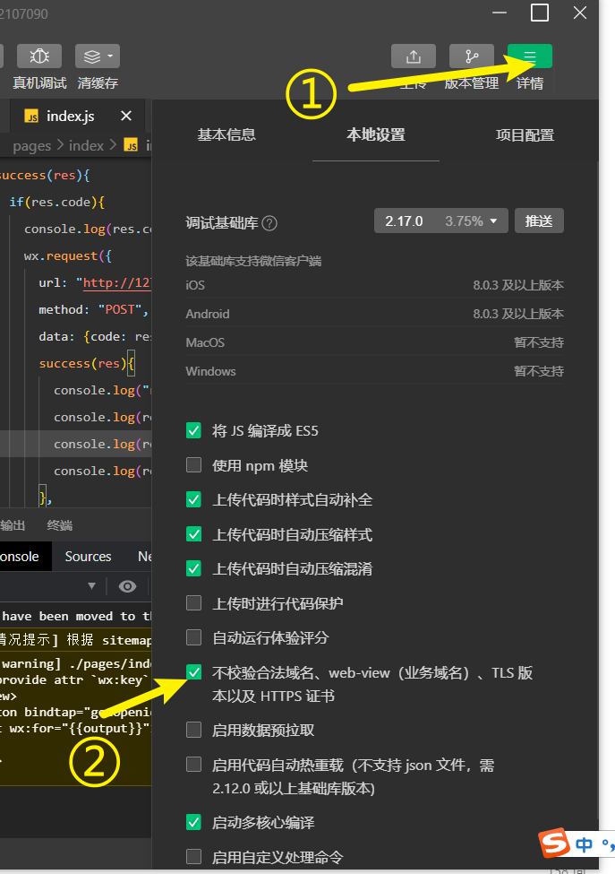

# 本地运行后端

## 运行方法

1. 获取最新版本的库

    ```shell
    git clone git@github.com:GJCav/wy-rsv.git
    ```

    或，更新到最新：

    ```shell
    git checkout backend
    git pull
    ```

  

2. 切换到backend分支并安装依赖，使用python 3.8

   ```shell
   cd wy-rsv/backend
   pip install -r requirements.txt
   ```

   

3. 运行服务：

   ```chell
   python run.py
   ```

   见到如下输出：

   ```
    * Serving Flask app 'app' (lazy loading)
    * Environment: production
      WARNING: This is a development server. Do not use it in a production deployment.
      Use a production WSGI server instead.
    * Debug mode: on
    * Restarting with stat
    * Debugger is active!
    * Debugger PIN: 345-423-045
    * Running on http://127.0.0.1:5000/ (Press CTRL+C to quit)
   ```

   表示服务器已经运行在本地，通过`http://127.0.0.1:5000/`访问服务器。

4. 解除微信小程序的请求限制：

   

   勾选“不检验合法域名xxxx”，记得在发布前取消勾选就行


## 测试选项

若要测试真实环境下行为，打开`config.py`，把第23行的

```python
config = DevelopmentConfig
```

改为：

```
config = ProductionConfig
```

然后自行决定下两行的设置：

```
skipLoginAndBind = False # 跳过登陆绑定验证，有可能出bug
skipAdmin = True		 # 跳过管理员验证
```


## 现在经过测试的API

* /login
* /bind
* /item/ 系列

   

