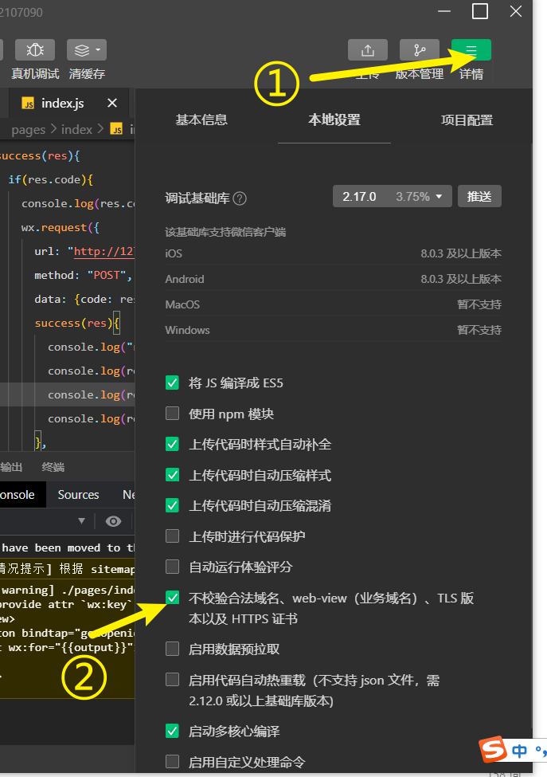

# 部署后端

## 下载代码

1. 获取最新版本的库

    ```shell
    git clone https://github.com/GJCav/thuwy.git
    ```

    或，更新到最新：

    ```shell
    git checkout backend
    git pull
    ```

  


## 配置`config.py`

在运行前需要进行一些配置，打开`backend/config.py`

进行如下配置：

### 配置数据库

1. 设置`UNIX_USERNAME`为运行后端的Linux用户名，可以在bash中用`whoami`得到当前用户名
2. 设置`DB_UNIX_SOCK`为MySQL的socket位置，可以通过`netstat -xa | grep mysql`找到路径位置


### 配置Minio接口凭证

```python
class MinioConfig:
    END_POINT = "static.thuwy.top"  # dev-static.thuwy.top 或者 static.thuwy.top
    FRONTEND_ORIGIN = "*"
    TARGET_BUCKET = "image"
    ACCESS_KEY = "access_key"   # 这里
    SECRET_KEY = "secret_key"   # 还有这里
```


### 设置运行环境

将下一行代码改为下列配置列表其中一项：

```
config = ProductionConfig
```

* `DevelopmentConfig`：配置为开发环境，开启自动代码重载，session秘钥固定。数据库为`thuwy_dev`
* `ProductionConfig`：配置为生产环境，启动时随机设置session秘钥。数据库为`thuwy`


### 设置微信接口凭证

1. 设置`WX_APP_ID`、`WX_APP_SECRET`，默认值对应小程序测试号，生成环境值可以联系管理员获取。

2. `MACHINE_ID`保持为0，不变。

3. ~~`THUWY_EMAIL_LICENSE`设置为管理员提供的微未央邮件令牌。~~

4. ~~`WX_SUBSC_TPL_ID`设置为管理员提供的微未央小程序消息推送ID。~~


## 配置 `run.py`

```python
from os import environ

if not environ.get("DEBUG"):
    import eventlet
    eventlet.monkey_patch()

from app import socketio_app, app


if __name__ == "__main__":
    socketio_app.run(app, port=6000) # 设置需要的端口
```


## 安装依赖

Python 版本：3.8


1. 配置虚拟环境：

    1. 初始化虚拟环境（只用执行一次）

        ```bash
        python3 -m venv venv
        ```

    2. 激活虚拟环境

       ```bash
       . venv/bin/active
       ```

       激活后，bash提示形如：

        ```
        (venv) user_name@balabala:~$
        ```

        看见那个venv即表明进入虚拟环境，退出虚拟环境可使用：

        ```bash
        deactive
        ```

    3. 下列操作默认在虚拟环境中进行

2. 切换到backend文件夹并安装依赖，使用

    ```shell
    cd thuwy/backend
    pip install -r requirements.txt
    ```

3. 配置`config`，打开`backend`文件夹，执行`cp config-template.py config.py`，然后跳转到**配置`config.py`**小节，配置完成后再进行下一步。

4. 进行一次基本的运行测试

   ```chell
   python3 run.py
   ```

   见到类似如下输出：

   ```
   (4432) wsgi starting up on http://0.0.0.0:5000
   ```

   表示服务器已经运行在本地，通过`http://127.0.0.1:5000/`访问服务器。


## 小程序开发环境配置

解除微信小程序的请求限制（若服务器运行在本地）：



勾选“不检验合法域名xxxx”，记得在发布前取消勾选就行


