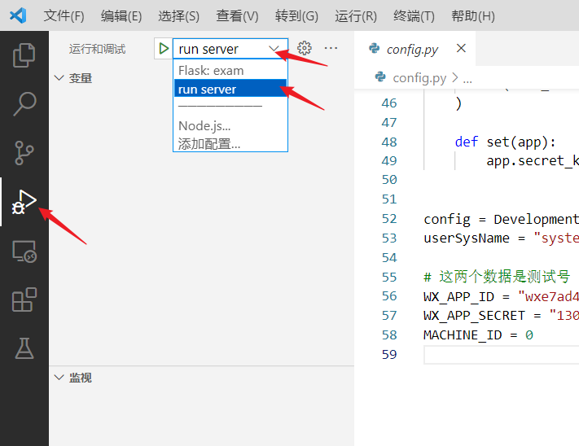
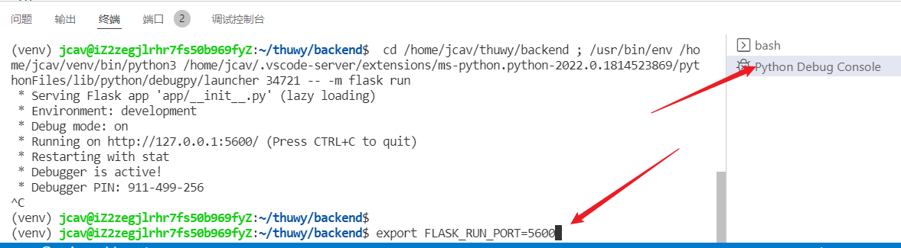

# 部署后端

## 下载代码 & 配置环境

1. 获取最新版本的库

    ```shell
    git clone https://github.com/GJCav/thuwy.git
    ```

    或，更新到最新：

    ```shell
    git checkout backend
    git pull
    ```

  

2. 切换到backend分支并安装依赖，使用python 3.8

   ```shell
   cd thuwy/backend
   pip install -r requirements.txt
   ```

   > 生产服务器中使用的python虚拟环境，需要先切换到虚拟环境.

3. 配置`config`，打开`backend`文件夹，执行`cp config-template.py config.py`，然后跳转到**配置`config.py`**小节，配置完成后再进行下一步。

4. 进行一次基本的运行测试

   ```chell
   python run.py
   ```

   见到如下输出：

   ```
   (4432) wsgi starting up on http://0.0.0.0:5000
   ```

   表示服务器已经运行在本地，通过`http://127.0.0.1:5000/`访问服务器。

5. 解除微信小程序的请求限制：

   

   勾选“不检验合法域名xxxx”，记得在发布前取消勾选就行

   

## 配置`config.py`

在运行前需要进行一些配置，打开`backend/config.py`

进行如下配置：

1. 配置数据库

    1. 设置`UNIX_USERNAME`为运行后端的Linux用户名，可以在bash中用`whoami`得到当前用户名
    2. 设置`DB_UNIX_SOCK`为MySQL的socket位置，可以通过`netstat -xa | grep mysql`找到路径位置
    
4. 设置运行环境，将下一行代码改为下列配置列表其中一项：
    ```
    config = ProductionConfig
    ```

    * `DevelopmentConfig`：配置为开发环境，开启自动代码重载，session秘钥固定。数据库为`thuwy_dev`
    * `ProductionConfig`：配置为生产环境，启动时随机设置session秘钥。数据库为`thuwy`
    
2. 设置`WX_APP_ID`、`WX_APP_SECRET`，默认值对应小程序测试号，生成环境值可以联系管理员获取。

4. `MACHINE_ID`保持为0，不变。

5. `THUWY_EMAIL_LICENSE`设置为管理员提供的微未央邮件令牌。

3. `WX_SUBSC_TPL_ID`设置为管理员提供的微未央小程序消息推送ID。


## 运行

### 本地测试

在`config.py`中设置`config = DevelopmentConfig`，按照如下操作：



然后按`F5`即可启动调试。

> 因为多人同时开发时都用5000端口会冲突，可以通过设置环境变量 `FLASK_RUN_PORT`为其他值避开冲突。
>
> 


